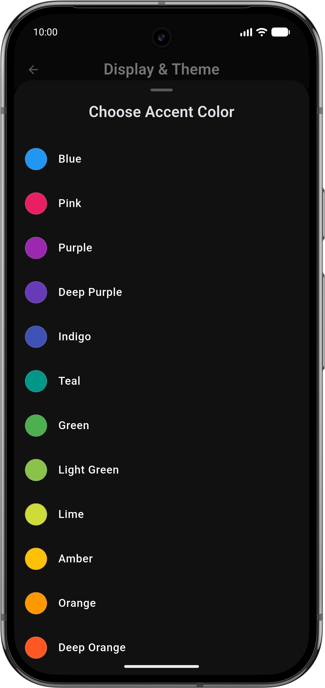

<h1 align="center">Trudido — Private and Minimalist Material You To-Do App</h1>

  A lightweight, privacy-first to-do app built with Flutter and Material You.

## ✨ Features

### 📋 Task Management
- Smart creation: titles, notes, due dates, and priorities  
- Organize tasks in folders and categories  
- Multiple views: list and calendar  
- Advanced filtering and sorting  
- Quick actions: swipe to edit/delete, multi-select for batch operations  

### 📝 Notes
- Markdown support with live preview
- Lock your Notes in a SHA-256 encrypted Vault

### 🎨 Design
- Material 3 interface
- Dynamic color (Material You, Android 12+)  
- Light/Dark modes  
- Custom accent themes (e.g., Dracula, Solarize)
- Responsive layout across devices  

### 🔒 Privacy
- 100 % offline — all data stored locally on your device  
- No tracking, ads, or analytics  
- Import/export functionality for complete data ownership

## 📸 Screenshots

  
  
  
  
  
  
  
  
  
  

